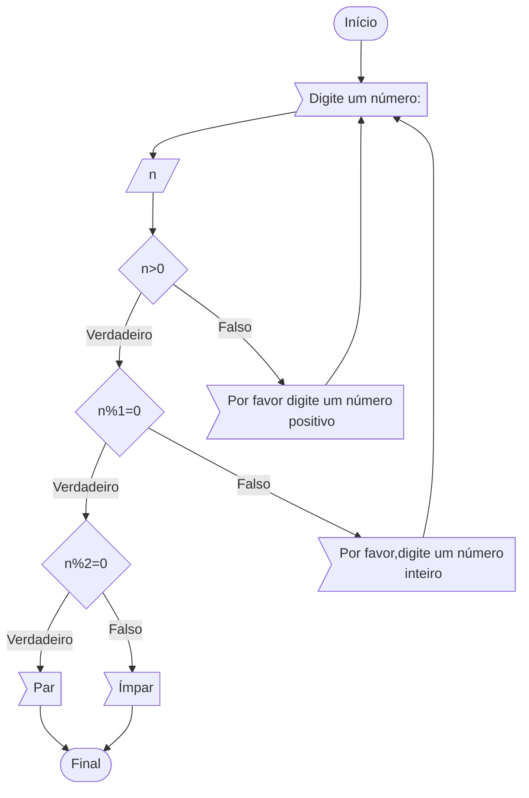

# unifor
#Fluxograma OBS:TIRar losango sintaxe erraDA
**Questão 1: Estruturas de repetição**
**Feito por: Ângelo Mendonça Rodrigues**

```mermaid
flowchart TD
A([Início]) --> B>Digite um número:]
B --> C[/n/]
C --> D{n>0}
D -- Verdadeiro --> E{n%1=0}
D -- Falso --> F>Por favor digite um número positivo]
F --> B
E -- Verdadeiro --> G{n%2=0}
E -- Falso --> H>Por favor,digite um número inteiro]
H --> B
G -- Verdadeiro --> I>Par]
G -- Falso -->J>Ímpar]
I --> K([Final])
J --> K
```
