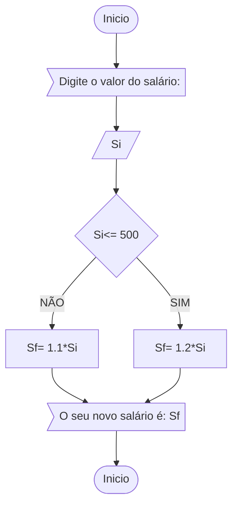

# unifor 
**Disciplina:** raciocínio lógico algoritmico


**EXERCÍCIO 2**


FLUXOGRAMA


PSEUDOCÓDIGO
```
Algoritmo "ContaAprovacoes"
var
      Si, Sf :numérico               //Si: salário inicial e Sf: salário final
inicio
     escreva ("Digite o valor do salário":)
     leia (Si)
     se Si <= 500 entao
        Sf<-- 1.2* Si             // 1.2* Si significa o aumento de 20% do salário inicial        
        escreva ("seu novo salário é:", Sf)
     senao
        Sf<-- 1.1* Si              //1.1* Si significa o aumento de 10% do salário inicial   
        escreva ("seu novo salário é:", Sf)
     fimse
FIM_ALGORITMO
```


**EXERCÍCIO 3**

FLUXOGRAMA


 
