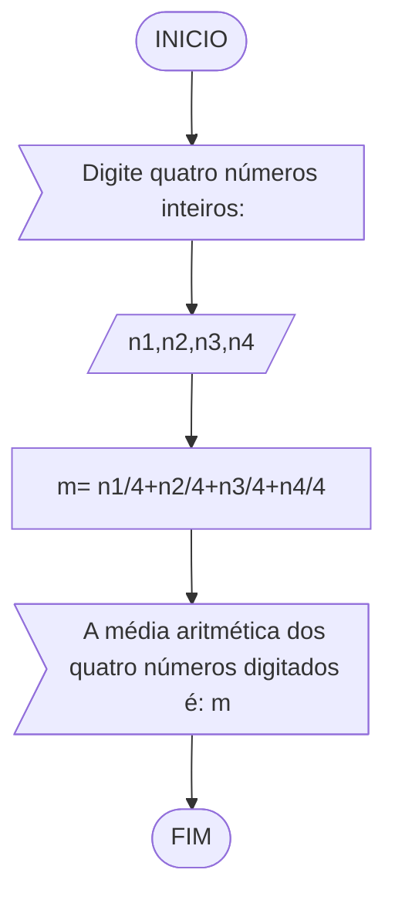
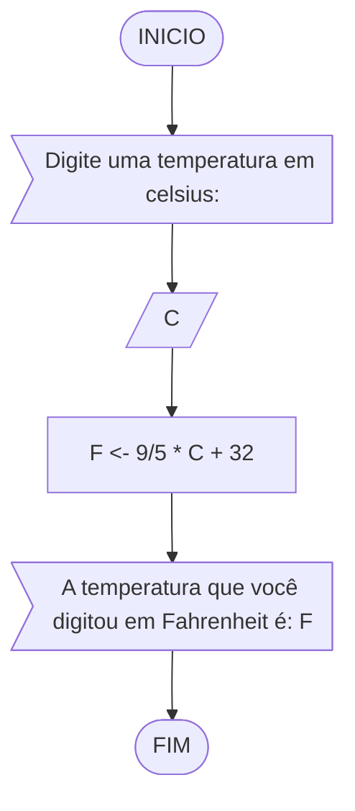
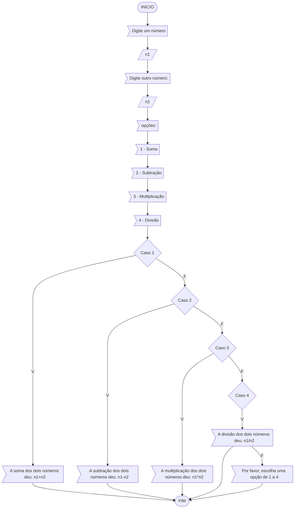

# unifor 
**Disciplina:** raciocínio lógico algoritmico


**EXERCÍCIO 1**
Calcule a média de quatro números inteiros dados.



```
Algoritmo "Media"
Var
  n1,n2, n3, n4 :real
Inicio
   Escreva ("Digite quatro números inteiros:")
   Leia (n1,n2,n3,n4)
   m<- n1/4+ n2/4+ n3/4+ n4/4
   Escreva ("A média aritmética dos quatro números digitados é:", m)
FIM_ALGORITMO
```


**EXERCÍCIO 2**
Leia uma temperatura dada em Celsius (C) e imprima o equivalente em Fahrenheit (F). (Fórmula de conversão: F = (9/5) * C + 32)


```
Algoritmo "ConverteCelsiusFarenheit"
Var
  F, C : inteiro
Inicio
  Escreva("Digite uma temperatura em celsius:)
  Leia (C)
   F <- (9/5) * C + 32)
   Escreva("A temperatura que você digitou em Fahrenheit é:", F)   
FIM_ALGORITMO
```

**EXERCÍCIO 3**
Receba dois números reais e um operador e efetue a operação correspondente com os valores recebidos (operandos). O algoritmo deve retornar o resultado da operação selecionada simulando todas as operações de uma calculadora simples.



```
Algoritmo "Calculadora"
var
  n1,n2, opcao :inteiro
inicio
   escreva ("Digite um número")
   leia(n1)
   escreva ("Digite outro número")
   leia(2)
    escreva("opções:")
    escreval (")
    escreval ("(1) - Soma")
    escreval ("(2) - subtração")
    escreval ("(3) - multiplicação")
    escreval ("(4) - divisão")
    escreval ("")
    escreva("Escolha uma opção:")
    leia (opcao)
    escolha (opcao)
      caso 1
         escreva("A soma dos dois números deu:", n1+n2)
         pare
      caso 2 
          escreva("A subtração dos dois números deu:", n1-n2)
          pare
      caso 3
          escreva("A multiplicação dos dois números deu:", n1*n2)
          pare
      caso 4
           escreva("A divisão dos dois números deu:", n1/n2)
           pare
      caso contrario
           escreva ("Por favor, escolha uma opção de 1 a 4")
FIM_ALGORITMO
```


### Exercício 04 (2.5 pontos)
Elaborar um algoritmo que, dada a idade, classifique nas categorias: infantil A (5 - 7 anos), infantil B (8 -10 anos), juvenil A (11 - 13 anos), juvenil B (14 -17 anos) e adulto (maiores que 18 anos).
