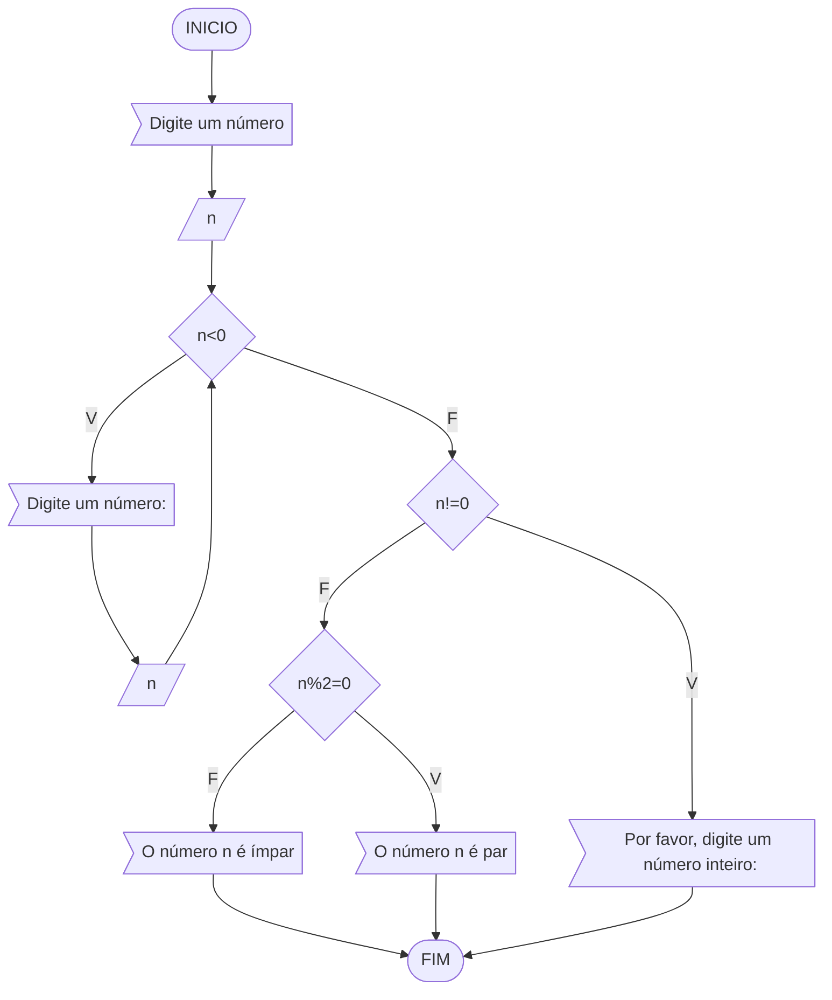

### Exercício 01
Atualize o algoritmo para determinar se um número inteiro e positivo é par ou ímpar, usando uma laço condicional para aceitar apenas números maiores ou iguais a zero. 





```
Algoritmo "ClassificaCategoria"
Var
  n
Inicio
   Escreva("Digite um número")
   Leia(n)
   Enquanto n<0 faca
       Escreva("Digite um número")
       Leia(n)
   FimEnquanto
   Se n%1 != 0 entao
       Escreva("Por favor, digite um número inteiro")
   Fimse
   Se n%2=0 entao
      Escreva("O número",n,"é par")
   Senao
      Escreva("O número",n,"é impar")
   FimSe
FIM_ALGORITMO
```

### Exercício 02
Faça um algoritmo que exiba na tela uma contagem de 0 até 30, exibindo apenas os múltiplos de 3.


```
Algoritmo "Questão2"
Var
  i:inteiro
Inicio
  Para i de 0 até 30 passo 3
    Escreva(i)
  FimPara
FIM_ALGORITMO
```
### Exercício 03
Dada uma sequência de números inteiros, calcular a sua soma. 
Por exemplo, para a sequência {12, 17, 4, -6, 8, 0}, o seu programa deve escrever o número 35.
