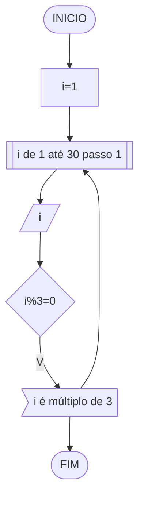
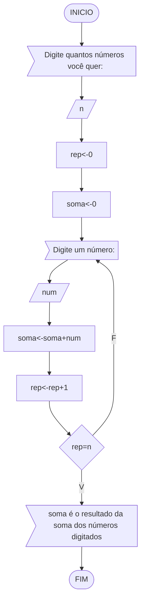
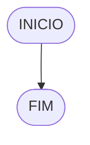

### Exercício 01
Atualize o algoritmo para determinar se um número inteiro e positivo é par ou ímpar, usando uma laço condicional para aceitar apenas números maiores ou iguais a zero. 


```
Algoritmo "ClassificaCategoria"
Var
  n
Inicio
   Escreva("Digite um número")
   Leia(n)
   Enquanto n<0 faca
       Escreva("Digite um número")
       Leia(n)
   FimEnquanto
   Se n%1 != 0 entao
       Escreva("Por favor, digite um número inteiro")
   Fimse
   Se n%2=0 entao
      Escreva("O número",n,"é par")
   Senao
      Escreva("O número",n,"é impar")
   FimSe
FIM_ALGORITMO
```

### Exercício 02
Faça um algoritmo que exiba na tela uma contagem de 0 até 30, exibindo apenas os múltiplos de 3.





```
Algoritmo "Questão2"
Var
  i:inteiro
Inicio
  i<-1
  Para i de 1 até 30 passo 1
    Leia(i)
    Se i%3=0 entao
       Escreva(i,"é múltiplo de 3")
    Fim_Se
  Fim_Para
Fim_Algoritmo  
```
### Exercício 03
Dada uma sequência de números inteiros, calcular a sua soma. 
Por exemplo, para a sequência {12, 17, 4, -6, 8, 0}, o seu programa deve escrever o número 35.




```
Algoritmo "Lista3_Soma"
// Função :Dada uma sequência de números inteiros, calcular a sua soma
// Autor : Ângelo Mendonça Rodrigues
// Data : 21/03/2024
// Seção de Declarações 
var
  n,num,rep,soma       :inteiro
inicio
  Escreva("Digite quantos números você quer:")
   Leia(n)   //n:quantidade de números 
   rep<-0    //rep:contador de repetições
   soma<-0   //soma:soma dos números digitados
   Repita
      Escreva("Digite um número:")
      Leia(num)  //num:números digitados
      soma<-soma+num
      rep<-rep+1
   ate rep=n
   Escreva(soma, "é o resultado da soma dos números digitados")
// Seção de Comandos
FIM_ALGORITMO
```
    
### Exercício 04
Escreva um programa que leia a nota de diversos alunos, até que seja digitada uma nota negativa. 
Nesse momento, ele mostra a média aritmética de todas as notas lidas e quantas notas foram lidas. 
Ex. Foram lidas 14 notas. A média aritmética é 6.75!

#### Fluxograma



#### Pseudocódigo

```
Algoritmo ClassificaCategoria
FIM_ALGORITMO
```
